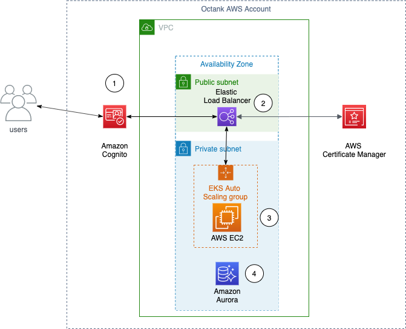
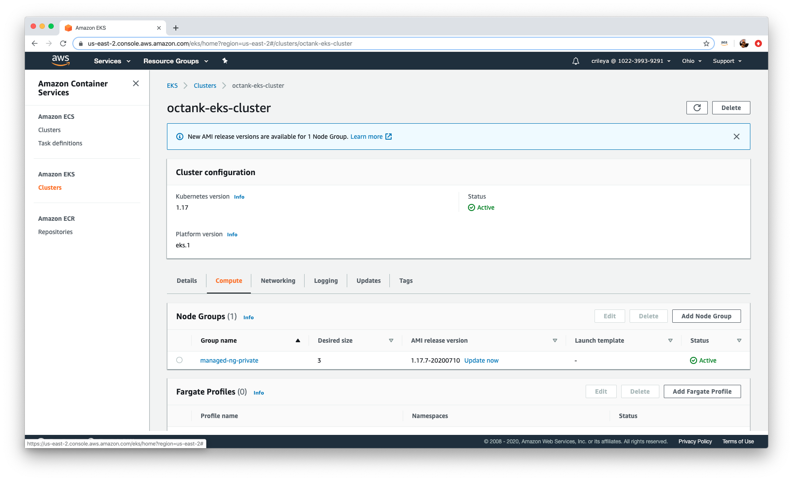

# Simulated Mortgage Broker Application in AWS

## Business Problem

Customer is migrating core legacy applications to Amazon Web Services (AWS). One application, the mortgage broker application, provides rates to the broker and will be enhanced with FICO details for a customer. This application needs to be migrated to AWS but done in such a fashion to allow for enhancement of the platform  This is to inform brokers as to what mortgage products would be most suitable prior to executing the lengthy approval process.

## Original Architecture

The original architecture is a three tier architecture comprised of web (React), middleware (Spring Boot), and a database tier (MySQL). Future development will be polyglot programming in nature as new hires and outsourced solutions are leveraged with alternative languages such as Node, Python and Go.

## Customer Challenges and Requests

The customer has identified challenges in supporting 1/ multiple environments, 2/ identification of costs associated with using containers in AWS and on-premises, 3/ and the desire to DevOps practices in software delivery. 

## Demonstration Story

The demonstration will focus on the topics discussed in prior conversations including security, agility, speed and cost savings. 


### Security

Discuss the use of Authentication, Encryption, Infrastructure Services, Container Scanning and Monitoring in support of current security practices.

### Agility

Demonstrate how teams can easily migrate solutions via containers to AWS to help provide scale, reliability and cost efficient solutions. Demonstrate how a developer can wrap an existing solution and share with the organization via a central registry.  Demonstrate how an operator can automate this process further simplifying the developer experience and improving deliverables.

### Speed

Demonstrate how teams can easily support DevOps practices through the use of Continuous Integration and Continuous Delivery to multiple environments (e.g. Sandbox and Testing).  

### Reduce Costs

Walk through TCO calculations providing an estimate of On-Premises versus AWS costs. 


## Technical Demonstration Detail

### Security

In the beginning of the presentation, the following AWS diagram is presented showing a simpler graphic of the core infrastructure. Ingress into the Octank cloud infrastructure occurs via ingress to publicly exposed Elastic Load Balancers in the public subnets. Traffic is then directed to the Elastic Kubernetes Cluster EC2 Managed Nodes running in private subnets. Security groups control access to the Kubernetes Cluster and Amazon Aurora database. Further security configuration can be performed using Kubernetes, EKS and AWS configurations including Encryption (in-transit / at-rest), access logging, VPC PrivateLink connections to Amazon S3, Amazon ECR and Amazon Cloudwatch.  




*Authentication*


* Use of Amazon Amplify to help establish Amazon Cognito User Stores for Authentication
* Integration of Amazon Amplify into React application 


*Privacy (Encryption)*


* AWS Certificate Manager integrated with Kubernetes Load Balancer
* TLS connections from brokers to Mortgage Broker Application
* TLS connections from Mortgage Broker Application to Credit and Mortgage APIs
* SSL/TLS connections from Credit and Mortgage APIs to Amazon Aurora
* S3 encryption CI/CD, Monitoring and Authentication details.


*Monitoring*


* Network Traffic - AWS VPC Flowlogs
* Application Logs - AWS Cloudwatch Container Insights
* API Access - AWS CloudTrail 


### Security (operator)

Show the manifest file and command used to spin up a cluster.

*eksctl cluster creation*

eksctl provides a command line interface to more easily create a Kubernetes cluster running in Amazon EKS. Using a yaml definition stored in Git, a EKS cluster can be created and managed appropriately. The following command line passes in the cluster name, Kubernetes version, AWS region, Kubernetes node details including size and quantity. 


#### An example of ClusterConfig object using Managed Nodes
```
    apiVersion: eksctl.io/v1alpha5
    kind: ClusterConfig
    
    metadata:
      name: octank-eks-cluster
      region: us-east-2
    
    managedNodeGroups:
      - name: managed-ng-private
        privateNetworking: true
        instanceType: m3.medium
        minSize: 1
        desiredCapacity: 1
        maxSize: 4
        availabilityZones: ["us-east-2a", "us-east-2b"]
        volumeSize: 20
        labels: {role: worker}
        tags:
          nodegroup-role: worker
```

```
$ eksctl create cluster -f octank-managed-node.yaml
[ℹ] eksctl version 0.24.0-rc.0
[ℹ] using region us-east-2
[ℹ] setting availability zones to [us-east-2a us-east-2b us-east-2c]
[ℹ] subnets for us-east-2a - public:192.168.0.0/19 private:192.168.96.0/19
[ℹ] subnets for us-east-2b - public:192.168.32.0/19 private:192.168.128.0/19
[ℹ] subnets for us-east-2c - public:192.168.64.0/19 private:192.168.160.0/19
[ℹ] using Kubernetes version 1.16
[ℹ] creating EKS cluster "octank-eks-cluster" in "us-east-2" region with managed nodes
[ℹ] 1 nodegroup (managed-ng-private) was included (based on the include/exclude rules)
[ℹ] will create a CloudFormation stack for cluster itself and 0 nodegroup stack(s)
[ℹ] will create a CloudFormation stack for cluster itself and 1 managed nodegroup stack(s)
[ℹ] if you encounter any issues, check CloudFormation console or try 'eksctl utils describe-stacks --region=us-east-2 --cluster=octank-eks-cluster'
[ℹ] CloudWatch logging will not be enabled for cluster "octank-eks-cluster" in "us-east-2"
[ℹ] you can enable it with 'eksctl utils update-cluster-logging --region=us-east-2 --cluster=octank-eks-cluster'
[ℹ] Kubernetes API endpoint access will use default of {publicAccess=true, privateAccess=false} for cluster "octank-eks-cluster" in "us-east-2"
[ℹ] 2 sequential tasks: { create cluster control plane "octank-eks-cluster", 2 sequential sub-tasks: { no tasks, create managed nodegroup "managed-ng-private" } }
[ℹ] building cluster stack "eksctl-octank-eks-cluster-cluster"
[ℹ] deploying stack "eksctl-octank-eks-cluster-cluster"
```


*Scaling nodes using eksctl*

```
$ eksctl scale nodegroup --cluster=octank-eks-cluster --nodes=3 managed-ng-private
[ℹ] scaling nodegroup stack "eksctl-octank-eks-cluster-nodegroup-managed-ng-private" in cluster eksctl-octank-eks-cluster-cluster
[ℹ] scaling nodegroup, desired capacity from 1 to 3
```

*kubectl*

kubectl provides a command line interface to communicate with the Kubernetes cluster by referencing the .kube/config file created by eksctl in the previous step. 

```
$ kubectl get nodes
NAME                                            STATUS   ROLES    AGE   VERSION
ip-192-168-124-237.us-east-2.compute.internal   Ready    <none>   33d   v1.17.7-eks-bffbac
ip-192-168-153-127.us-east-2.compute.internal   Ready    <none>   33d   v1.17.7-eks-bffbac
ip-192-168-175-74.us-east-2.compute.internal    Ready    <none>   33d   v1.17.7-eks-bffbac
$ kubectl get namespaces
NAME                STATUS   AGE
amazon-cloudwatch   Active   25d
default             Active   33d
kube-node-lease     Active   33d
kube-public         Active   33d
kube-system         Active   33d
octank-sandbox      Active   33d
octank-testing      Active   25d
spinnaker           Active   21d
```

*Amazon EKS Console*

Once eksctl is complete in creating a cluster, the Amazon EKS console displays the cluster.


Detailed information includes information around endpoints for the cluster control plane.


In addition, the Compute tab displays the node groups, desired size and status.



Notice in the above diagram that Public access source whitelist allows all traffic (e.g. 0.0.0.0/0). This can be modified by selecting Manage Networking and identifying the sources to public access endpoint as shown below:


Selection of the standard-workers group name will provide more specifics on the running nodes as shown below. Notice that Allow remote access to nodes is Disabled. This can be controlled via eksutil. In addition there is an Autoscaling Group that has been created to maintain at least two nodes at all times. The following link provides details on creating autoscaling policies to track CPU and right-size instances  https://docs.aws.amazon.com/eks/latest/userguide/autoscaling.html


*eksctl cluster deletion*

```
$ eksctl delete cluster --name <cluster name>
[ℹ] eksctl version 0.24.0-rc.0
[ℹ] using region us-east-2
[ℹ] deleting EKS cluster "prod"
[ℹ] deleted 0 Fargate profile(s)
[✔] kubeconfig has been updated
[ℹ] cleaning up LoadBalancer services
[ℹ] 2 sequential tasks: { delete nodegroup "standard-workers", delete cluster control plane "prod" [async] }
[ℹ] will delete stack "eksctl-prod-nodegroup-standard-workers"
[ℹ] waiting for stack "eksctl-prod-nodegroup-standard-workers" to get deleted
[ℹ] will delete stack "eksctl-prod-cluster"
[✔] all cluster resources were deleted
```

*EKS Connection Issues*

Error: EKS connection failure: The connection to the server localhost:8080 was refused - did you specify the right host or port?
Resolution: Run the following command to refresh the .kube/config to point to a running cluster

```
$ kubectl version -o json
{
  "clientVersion": {
    "major": "1",
    "minor": "17+",
    "gitVersion": "v1.17.7-eks-bffbac",
    "gitCommit": "bffbacfd13a805a12d10ccc0ca26205ae1ca76e9",
    "gitTreeState": "clean",
    "buildDate": "2020-07-08T18:30:00Z",
    "goVersion": "go1.13.9",
    "compiler": "gc",
    "platform": "darwin/amd64"
  },
  "serverVersion": {
    "major": "1",
    "minor": "17+",
    "gitVersion": "v1.17.6-eks-4e7f64",
    "gitCommit": "4e7f642f9f4cbb3c39a4fc6ee84fe341a8ade94c",
    "gitTreeState": "clean",
    "buildDate": "2020-06-11T13:55:35Z",
    "goVersion": "go1.13.9",
    "compiler": "gc",
    "platform": "linux/amd64"
  }
}
```

The connection to the server localhost:8080 was refused - did you specify the right host or port?

```
$ aws eks --region us-east-2 update-kubeconfig --name octank-eks-cluster
$ kubectl version
Client Version: version.Info{Major:"1", Minor:"17+", GitVersion:"v1.17.7-eks-bffbac", GitCommit:"bffbacfd13a805a12d10ccc0ca26205ae1ca76e9", GitTreeState:"clean", BuildDate:"2020-07-08T18:30:00Z", GoVersion:"go1.13.9", Compiler:"gc", Platform:"darwin/amd64"}
Server Version: version.Info{Major:"1", Minor:"17+", GitVersion:"v1.17.6-eks-4e7f64", GitCommit:"4e7f642f9f4cbb3c39a4fc6ee84fe341a8ade94c", GitTreeState:"clean", BuildDate:"2020-06-11T13:55:35Z", GoVersion:"go1.13.9", Compiler:"gc", Platform:"linux/amd64"}
```
### Security (developer)

The base application does not implement authentication or privacy. This section details the addition of authentication to the React broker-app. AWS Amplify provides details on how to integrate into a React application along with using the amplify command line to standup a Amazon Cognito User Pool. 

https://docs.amplify.aws/start/getting-started/auth/q/integration/react

For the React application in broker-app, the aws-export.js file gets created in the src folder. In addition the following code updates were made once npm installation of amplify and amplify react is performed in the link above. In App.js, the aws-amplify/ui-react library is imported, AmplifySignOut added as a component in the container and the export updated with a higher order component (withAuthenticator(App)). 

```
import React from 'react';
import Header from './Header';
import RatesList from './RatesList';
import CreditCheck from './CreditCheck';
import DisplayEnv from './DisplayEnv';
import { withAuthenticator, AmplifySignOut } from '@aws-amplify/ui-react';


const App = () => {
    return (
    <div className="container">
        <AmplifySignOut />
        <br />
        <Header />
        <br />
        <RatesList />
        <br />
        <CreditCheck />
        <br />
        <DisplayEnv />
    </div>
    );
}

export default withAuthenticator(App);
```

Completion of the above places an authentication form as shown below that is integrated with the Cognito User Pool identified in the aws-exports.js. 


### Reallocate Teams (developer)

The next phase is to demonstrate how a developer can easily wrap a React Application as a container and share it with the larger organization. First we utilize Docker installed on Mac or Windows to test container development. 


1. Demonstrate the addition of a new component in a React application. 
2. Use “npm run build” to create the production version of the application.
3. Use “docker build -t 102239939291.dkr.ecr.us-east-2.amazonaws.com/broker-app:0.0.2 .”
4. Select the ECR push example to walk through publishing.

```
$ aws ecr get-login-password --region us-east-2 | docker login --username AWS --password-stdin 102239939291.dkr.ecr.us-east-2.amazonaws.com
$ docker push 102239939291.dkr.ecr.us-east-2.amazonaws.com/broker-app:0.0.2
```

1. Show how ECR scans the deployed artifact.

*Image Registry*

Amazon Elastic Container Registry performs a scan of new images to identify Common Vulnerabilities or Exploits (CVE) and reports those per image tag. The image registry represents the private location that Continuous Delivery or developers use to access the appropriate tagged images.


[Image: Screen Shot 2020-07-14 at 11.15.56 AM.png]*CVE Scanning (Well Architected Security Pillar)*

New containers are scanned on push into the registry as shown in the following areas and simply displayed under the Vulnerabilities column within the images under a repository. 

[Image: Screen Shot 2020-07-14 at 2.43.35 PM.png]Digging deeper into the Vulnerabilities shows the specific Common Vulnerabilities and Exploits (CVE). CVEs are listed in priority order. 
[Image: Screen Shot 2020-07-14 at 2.43.40 PM.png]Digging even deeper, links to the specific CVE are provided along with package / library that is impacted.

[Image: Screen Shot 2020-07-14 at 2.46.45 PM.png]
Time to Market

The next phase is to demonstrate mechanisms to reduce the time it takes to deliver software. Continuous Integration and Continuous Delivery demonstrations will show automation reducing the level of effort and increasing the consistency and traceability of software. 

Time to Market (Continuous Integration) 

*Source Code Management*

Each project is stored within CodeCommit separately providing support for Git branching strategies for development teams to collaborate and have full transparency of the code base.

Created CodeCommit repositories for both UI and two APIs.

[Image: Screen Shot 2020-07-14 at 11.11.38 AM.png]

*Application Overview*

*Mortgage API*

The mortgage API is a spring boot based application. The core components are described below and it incorporates JPA to help integrate with a MySQL backend. 

* Spring Boot API src
* Maven pom.xml
* buildspec.yml (CodeBuild)
* Dockerfile (container definition)
* Helm 3 Chart


*Credit API*

The credit API is a NodeJS based application. The core components are described below and it incorporates the mysql package to help integrate with the MySQL backend.

* NodeJS API src
* package.json
* buildspec.yml (CodeBuild)
* imagedefinitions.json
* Dockerfile (container definition)
* Helm 3 chart


*Broker Application*


* React src
* package.json
* buildspec.yml (CodeBuild)
* imagedefinitions.json
* Dockerfile (container definition)
* Helm 3 chart


*Automated Build*

The automated build leverages AWS CodePipeline, AWS CodeCommit and AWS CodeBuild to take changes to the source branch, execute tests, perform the Container Build and push the resulting image to Amazon ECR. 

[Image: Screen Shot 2020-07-14 at 11.16.23 AM.png]

*Test Automation*

Each project leverages a suitable test automation framework for Unit Testing (e.g. JUnit, Jest) and this test is executed by the package management solution (e.g. maven, npm) during the build process.

Time to Market (Continuous Delivery)

Continuous Delivery in this demonstration will leverage Spinnaker (https://spinnaker.io/), a Netflix OSS project. 

*Helm Kubernetes Package Management*

Once the K8S cluster is running, each containerized application / API can use Helm 3 to define the required Kubernetes manifests / objects.


```
$ helm create mortgage-api-chart
Creating mortgage-api-chart
```

Once the chart is created, the developer access the values.yaml under the mortgage-api-chart directory and changes the following values to specify the ECR Repository, image name and tag:

```
image:
  repository: 102239939291.dkr.ecr.us-east-2.amazonaws.com/octank/mortgage-api
  pullPolicy: Always
  # Overrides the image tag whose default is the chart appVersion.
  tag: "latest"
```

In addition a load balancer is required to bridge public traffic to the EKS nodes running in the Private Subnets. 

```
service:
 type: LoadBalancer
 port: 8080
```

Finally the health / readiness checks need to be updated to allow the Load Balancer to bring the application into service. This is located under the mortgage-api-chart/template/deployment.yaml . This file is updated to change the containerPort which is listening on 8080 and the path from / to /rates.

```
ports:
            - name: http
              containerPort: 8080
              protocol: TCP
          livenessProbe:
            httpGet:
              path: /rates
              port: http
          readinessProbe:
            httpGet:
              path: /rates
              port: http
```

Once these two edits are complete, we can install the chart into EKS. 

```
$ helm install mortgage-api mortgage-api-chart
NAME: mortgage-api
LAST DEPLOYED: Wed Jul 22 14:23:34 2020
NAMESPACE: default
STATUS: deployed
REVISION: 1
NOTES:
1. Get the application URL by running these commands:
     NOTE: It may take a few minutes for the LoadBalancer IP to be available.
           You can watch the status of by running 'kubectl get --namespace default svc -w mortgage-api-mortgage-api-chart'
  export SERVICE_IP=$(kubectl get svc --namespace default mortgage-api-mortgage-api-chart --template "{{ range (index .status.loadBalancer.ingress 0) }}{{.}}{{ end }}")
  echo http://$SERVICE_IP:8080

Once the above is complete, the operator can use kubectl to confirm the service is running and dig deeper by using kubectl get pods <podname>. 
```

```
$ kubectl get pods
NAME                                               READY   STATUS    RESTARTS   AGE
mortgage-api-mortgage-api-chart-7cb65f8bcf-wzdxm   1/1     Running   0          60s
3c22fb12e21b:mortgage-api crileya$ kubectl describe pods mortgage-api-mortgage-api-chart-7cb65f8bcf-wzdxm
Name:         mortgage-api-mortgage-api-chart-7cb65f8bcf-wzdxm
Namespace:    default
Priority:     0
Node:         ip-192-168-148-159.us-east-2.compute.internal/192.168.148.159
Start Time:   Wed, 22 Jul 2020 14:26:43 -0400
Labels:       app.kubernetes.io/instance=mortgage-api
              app.kubernetes.io/name=mortgage-api-chart
              pod-template-hash=7cb65f8bcf
Annotations:  kubernetes.io/psp: eks.privileged
Status:       Running
IP:           192.168.137.29
IPs:
  IP:           192.168.137.29
Controlled By:  ReplicaSet/mortgage-api-mortgage-api-chart-7cb65f8bcf
Containers:
  mortgage-api-chart:
    Container ID:   docker://617c9c1e42c029f42f0818277e85a0347e406f33145ea70ed88c50ea478a58ae
    Image:          102239939291.dkr.ecr.us-east-2.amazonaws.com/octank/mortgage-api:0.0.1
    Image ID:       docker-pullable://102239939291.dkr.ecr.us-east-2.amazonaws.com/octank/mortgage-api@sha256:4db40beccb71f015f7bf30bd521fce447dcafea8e5a3af44b1711c619f242f3b
    Port:           8080/TCP
    Host Port:      0/TCP
    State:          Running
      Started:      Wed, 22 Jul 2020 14:26:44 -0400
    Ready:          True
    Restart Count:  0
    Liveness:       http-get http://:http/rates delay=0s timeout=1s period=10s #success=1 #failure=3
    Readiness:      http-get http://:http/rates delay=0s timeout=1s period=10s #success=1 #failure=3
    Environment:    <none>
    Mounts:
      /var/run/secrets/kubernetes.io/serviceaccount from mortgage-api-mortgage-api-chart-token-m4ljp (ro)
Conditions:
  Type              Status
  Initialized       True 
  Ready             True 
  ContainersReady   True 
  PodScheduled      True 
Volumes:
  mortgage-api-mortgage-api-chart-token-m4ljp:
    Type:        Secret (a volume populated by a Secret)
    SecretName:  mortgage-api-mortgage-api-chart-token-m4ljp
    Optional:    false
QoS Class:       BestEffort
Node-Selectors:  <none>
Tolerations:     node.kubernetes.io/not-ready:NoExecute for 300s
                 node.kubernetes.io/unreachable:NoExecute for 300s
Events:
  Type    Reason     Age   From                                                    Message
  ----    ------     ----  ----                                                    -------
  Normal  Scheduled  78s   default-scheduler                                       Successfully assigned default/mortgage-api-mortgage-api-chart-7cb65f8bcf-wzdxm to ip-192-168-148-159.us-east-2.compute.internal
  Normal  Pulled     77s   kubelet, ip-192-168-148-159.us-east-2.compute.internal  Container image "102239939291.dkr.ecr.us-east-2.amazonaws.com/octank/mortgage-api:0.0.1" already present on machine
  Normal  Created    77s   kubelet, ip-192-168-148-159.us-east-2.compute.internal  Created container mortgage-api-chart
  Normal  Started    77s   kubelet, ip-192-168-148-159.us-east-2.compute.internal  Started container mortgage-api-chart
```

*Helm Cleanup*

```
$ helm uninstall mortgage-api
release "mortgage-api" uninstalled
```

*Kubernetes ConfigMap and Secrets*

To support multiple environments and simplify delivery, applications should be parameterized for any connectivity or secret information used. 

*Mortgage API Configuration*

First we parameterize the data that needs to be injected into the Pods via ConfigMap or Secret definitions.

*#Amazon Aurora
```
spring.datasource.url=jdbc:mysql://${AURORA_SERVICE}:3306/${AURORA_DB}
spring.datasource.username=${AURORA_USERNAME}
spring.datasource.password=${AURORA_PASSWORD}
spring.datasource.driver-class-name=com.mysql.jdbc.Driver
spring.jpa.hibernate.ddl-auto=none
spring.jpa.generate-ddl=true
spring.jpa.properties.hibernate.dialect=org.hibernate.dialect.MySQL5Dialect
```

To test locally we can set the environment variable SPRING_APPLICATION_JSON with the variables above as shown below:


```
export SPRING_APPLICATION_JSON='{"AURORA_SERVICE":"localhost","AURORA_DB":"rates","AURORA_USERNAME":"root","AURORA_PASSWORD":"my-secret-pw"}
```


This allows us to test the parameterization of the application.properties and also allow a maven package to be executed resulting in the jar file needed by Docker. For the above, a local MySQL instance is spun up in Docker locally. 

Second we create the ConfigMap definition via kubectl so that it exists within Kubernetes and is stored in etcd.


```
$ kubectl create configmap aurora-config \
    --from-literal=aurora.service=<aurora url> \
    --from-literal=aurora.db=rates
$ kubectl describe configmap aurora-config
Name: aurora-config
Namespace: default
Labels: <none>
Annotations: <none>

Data
====
aurora.db:
----
rates
aurora.service:
----
mortgage-api.xxx.us-east-2.rds.amazonaws.com
Events: <none>
```

Or we can define a ConfigMap object instead for Infrastructure as Code 


```
apiVersion: v1
kind: ConfigMap
metadata:
  name: aurora-config
data:
  # property-like keys; each key maps to a simple value
  aurora.db: "rates"
  aurora.service: "mortgage-api.sandbox.us-east-2.rds.amazonaws.com"
```

Third we create the Secret definition via kubectl so that it exists within Kubernetes and is stored in etcd.

```
$ kubectl create secret generic db-security \
    --from-literal=db.user.name=someuser \
    --from-literal=db.user.password=somepassword
$ kubectl describe secret db-security
Name: db-security
Namespace: default
Labels: <none>
Annotations: <none>

Type: Opaque

Data
====
db.user.name: 16 bytes
db.user.password: 28 bytes
```

Or we can create a Secret object instead (note the user/password fields are base64 encoded)

```
apiVersion: v1
kind: Secret
metadata:
  name: db-security
type: Opaque
data:
  db.user.password: cxxtZStwYXNzd29yZAo=
  db.user.name: bxxx3FsX2FkbWluCg==
```


Within the Helm chart, we modify the templates/deployment.yaml to add an environment section as shown below which then binds the ConfigMap and Secrets object. 


```
...
containers:
        - name: {{ .Chart.Name }}
          securityContext:
            {{- toYaml .Values.securityContext | nindent 12 }}
          image: "{{ .Values.image.repository }}:{{ .Values.image.tag | default .Chart.AppVersion }}"
          imagePullPolicy: {{ .Values.image.pullPolicy }}
          env:
            - name: AURORA_DB
              valueFrom:
                configMapKeyRef:
                  name: aurora-config
                  key: aurora.db.name
            - name: AURORA_SERVICE
              valueFrom:
                configMapKeyRef:
                  name: aurora-config
                  *key**: aurora.db.service*
            - *name**: AURORA_USERNAME*
              valueFrom:
                secretKeyRef:
                  name: aurora-security
                  *key**: db.user.name*
            - *name**: AURORA_PASSWORD*
              valueFrom:
                secretKeyRef:
                  name: aurora-security
                  *key**: db.user.password*
          ports:
...
```

*Credit API Configuration*

First we set environment variables for the environment and user/password details

```
export AURORA_USERNAME=xxx
export AURORA_PASSWORD=xxx
export AURORA_SERVICE=mortgage-api.xxx.rds.amazonaws.com
export AURORA_DB_CREDIT=credit
```

Second the NodeJS code leverages the config npm dependency to configure environments and access variables from within the codebase or through local environment variables (mapping is stored in custom-environment-variables.json under config/). The following shows the mapping of the db_user and db_password environment variables to user and password.


```
{
    "user": "AURORA_USERNAME",
    "password": "AURORA_PASSWORD",
    "url": "AURORA_SERVICE",
    "database": "AURORA_DB_CREDIT"
}
```

The mysql connection object then replaces values with those mappings so user and password will refer to the environment variables.  whereas the url and database are found in the development.json.


```
var connection = mysql.createConnection({
    host     : config.get('url'),
    user     : config.get('user'),
    password : config.get('password'),
    database : config.get('database')
});
```

This information is then mapped to Deployment, ConfigMap and Secret definitions for Kubernetes. 

```
env:
- name: AURORA_DB_CREDIT
  valueFrom:
    configMapKeyRef:
       name: aurora-config
       key: aurora.db.credit
- name: AURORA_SERVICE
  valueFrom:
    configMapKeyRef:
       name: aurora-config
       key: aurora.db.service
- name: AURORA_USERNAME
  valueFrom:
    secretKeyRef:
      name: aurora-security
      key: db.user.name
- name: AURORA_PASSWORD
  valueFrom:
    secretKeyRef:
      name: aurora-security
      key: db.user.password
```

*Broker Application*

The broker application requires a different approach when parameterizing values. React in its default form compiles configuration details during the build. To resolve this a configuration file is articulated in the index.html file via the following entry. This allows the file to be replaced / externalized in Kubernetes.


```
<script type="text/javascript" src="%PUBLIC_URL%/config.js"></script>
```

Second a configuration, config.json,  as described below is used to help parameterize the URL and Environment name.


```
window.ENV = {
    "ENVIRONMENT":"Sandbox",
    "CREDIT_API_URL": 'http://a9347a68491c148888eddca613b59b58-928692631.us-east-2.elb.amazonaws.com:5000/credit',
    "MORTGAGE_API_URL": 'http://a2440a047da2d4948a657f60ece04342-364399738.us-east-2.elb.amazonaws.com:8080/rates'
}
```

Inside the React application, the following shows integration of the values via window.ENV.<parameter name>. 


```
return (<div className="card">
    <div className="card-body">
        <h4 className="card-title">Application Environment Details</h4>
        <table class="table">
            <th>Property</th>
            <th>Value</th>
            <tr>
                <td>Environment</td>
                <td>{window.ENV.ENVIRONMENT}</td>
            </tr>
            <tr>
                <td>Credit Rating API URL</td>
                <td>{window.ENV.CREDIT_API_URL}</td>
            </tr>
            <tr>
                <td>Mortgage Rates API URL</td>
                <td>{window.ENV.MORTGAGE_API_URL}</td>
            </tr>
        </table>
    </div>
</div>
);
```


The config.json is deployed to Kubernetes via a ConfigMap as shown below for sandbox and is defined as a file versus specifying environment variables.

```
kubectl create configmap broker-app-config --from-file=./sandbox/config.js -n octank-sandbox
```

Once this has been deployed, the Helm chart is updated to mount this file to the Pod when it is running and thus make the environment details bind.


```
...
          volumeMounts:
          - name: broker-app-config-volume
            readOnly: true
            mountPath: /usr/share/nginx/html/config.js
            subPath: config.js
...
      volumes:
        - name: broker-app-config-volume
          configMap:
            # Provide the name of the ConfigMap containing the files you want
            # to add to the container
            name: broker-app-config
```


### Continuous Delivery (Well Architected Operational Excellence Pillar)

Once an image has been pushed to ECR, Spinnaker.io (http://spinnaker.io/) performs a deployment to the EKS sandbox namespace. As part of this process, a smoke test is executed to confirm base functionality. If this fails, the deployment is rolled back. If it succeeds, a deployment to staging is performed with a similar smoke test. 

#### Installation

Use the following instructions to install halyard locally and leveraged eksctl, kubectl, aws cli and other tools to perform the installation:

https://spinnaker.io/setup/install/providers/kubernetes-v2/aws-eks/

Once installed the following pods displayed:


```
$ kubectl -n spinnaker get pods
NAME READY STATUS RESTARTS AGE
spin-clouddriver-f54c5c76-7bzjz 1/1 Running 0 4m8s
spin-deck-5c7cb9db95-mdkwf 1/1 Running 0 4m10s
spin-echo-5c578b8574-2cmfh 1/1 Running 0 4m8s
spin-front50-5df6d9cbc9-drdbw 1/1 Running 0 4m9s
spin-gate-7dfd4f8dd7-8pb8w 1/1 Running 0 4m9s
spin-orca-7ff69bdd57-4clwt 1/1 Running 0 4m9s
spin-redis-76f844dbc-mh9tr 1/1 Running 0 6m21s
spin-rosco-d4465f598-9mwnk 1/1 Running 0 4m9s
```

Installation also exposed deck and gate pods with ELB:


```
$ kubectl -n spinnaker get svc
NAME               TYPE           CLUSTER-IP       EXTERNAL-IP                                                               PORT(S)        AGE
spin-clouddriver   ClusterIP      10.100.37.5      <none>                                                                    7002/TCP       3m21s
spin-deck          ClusterIP      10.100.80.68     <none>                                                                    9000/TCP       3m19s
spin-deck-public   LoadBalancer   10.100.118.120   a2086467535d549d7a5039b70b25dbcf-655240930.us-east-2.elb.amazonaws.com    80:32160/TCP   2m11s
spin-echo          ClusterIP      10.100.124.110   <none>                                                                    8089/TCP       3m19s
spin-front50       ClusterIP      10.100.129.83    <none>                                                                    8080/TCP       3m20s
spin-gate          ClusterIP      10.100.57.105    <none>                                                                    8084/TCP       3m19s
spin-gate-public   LoadBalancer   10.100.168.165   a0bf1b2a5abd74c538098524f223330a-1152939141.us-east-2.elb.amazonaws.com   80:30830/TCP   2m19s
spin-orca          ClusterIP      10.100.11.93     <none>                                                                    8083/TCP       3m20s
spin-redis         ClusterIP      10.100.171.194   <none>                                                                    6379/TCP       3m20s
spin-rosco         ClusterIP      10.100.143.38    <none> 
```

Once up and running accessing the Spinnaker UI by accessing the spin-deck-public service. 

[Image: Screen Shot 2020-08-04 at 2.42.19 PM.png]

Once the display is available, selecting applications provides a list of available applications by looking a the deployments in Kubernetes:

[Image: Screen Shot 2020-08-04 at 4.12.01 PM.png]

*Spinnaker Pipeline*

Spinnaker is able to query the Kubernetes cluster for existing applications, in our example we started with using Helm to install to the cluster. A pipeline is a series of user defined steps to deploy to Kubernetes. The image below shows the broker-app.

[Image: Screen Shot 2020-08-10 at 9.52.51 AM.png]


The GUI allows one to *Add stage* steps which in this case starts with Configuration, Bakes the Manifest, Deploy to Sandbox, Verify Sandbox Deployment and finally Deploy to Testing. The configuration step access a S3 bucket to read in Helm configuration defined previously and packaged using the following command:


```
$ helm package broker-app-chart
Successfully packaged chart and saved it to: /Users/crileya/Work/MB/MB3/octank-infrastructure/helm/broker-app-chart-0.0.1.tgz
```

This artifact is uploaded to S3 as shown below:

[Image: Screen Shot 2020-08-10 at 9.57.07 AM.png]

Once uploaded, the configuration step consumes the helm chart package and moves to the bake step.

[Image: Screen Shot 2020-08-10 at 9.59.51 AM.png]

The output of the bake step is to generate an artifact (base64 encoded) and identified as broker-app-chart. This is referenced in the Deploy stages that follow.

[Image: Screen Shot 2020-08-10 at 9.59.56 AM.png]

The deploy to sandbox stage calls out the previously baked artifact and also specifies the octank-sandbox namespace.

[Image: Screen Shot 2020-08-10 at 10.03.33 AM.png]

This stage leverages Kubernetes to rollout of the application. Spinnaker can also manage the release if it is enabled as shown below:

[Image: Screen Shot 2020-08-10 at 10.05.13 AM.png]

Upon completion of the deployment, a verification stage occurs waiting for approval. 

[Image: Screen Shot 2020-08-10 at 10.07.45 AM.png]

Finally we deploy to octank-testing namespace as shown below.

[Image: Screen Shot 2020-08-10 at 10.07.50 AM.png]

Once the deployment is complete, the endpoint for the broker-app is available by selecting Load Balancer to get the DNS entry. 

*Scaling / Rollback*

Once the cluster is running, update of the deployment can be performed to scale out the replicas as well as undo the rollout.

Configure S3 for Helm Chart Storage in Spinnaker

https://docs.armory.io/docs/spinnaker-install-admin-guides/s3/

https://aws.amazon.com/blogs/opensource/continuous-delivery-spinnaker-amazon-eks/

https://www.youtube.com/watch?v=05EZx3MBHSY


### Authentication / Authorization for Mortgage Broker Application

https://itnext.io/aws-cognito-example-using-react-ui-and-node-js-rest-apis-part-1-cognito-setup-5597acb02db4
https://itnext.io/aws-cognito-example-using-react-ui-and-node-js-rest-apis-part-2-react-ui-app-with-redux-6cc22610affe
https://itnext.io/aws-cognito-example-using-react-ui-and-node-js-rest-apis-part-3-jwt-secured-rest-apis-e56d336ce306
https://itnext.io/using-letsencrypt-ssl-certificates-in-aws-certificate-manager-c2bc3c6ae10

#### GoDaddy / Route53 / ELB configuration

https://lobster1234.github.io/2017/05/10/migrating-a-domain-to-amazon-route53/

Purchased domain from GoDaddy with the following DNS properties.

[Image: Screen Shot 2020-08-12 at 11.49.17 AM.png]

Created a Hosted Zone with Public Domain under Route 53. The following image shows the demo2company.com (http://demo2company.com/) details below.

[Image: Screen Shot 2020-08-12 at 11.54.28 AM.png]

Within GoDaddy DNS Administration, export the Zone details (e.g. Export Zone File (Unix)) for import into Route53. This is available as shown below:

[Image: Screen Shot 2020-08-12 at 11.57.00 AM.png]

Export of the file (UNIX) was done and it create the following details:

```
; Domain: demo2company.com
; Exported (y-m-d hh:mm:ss): 2020-08-12 08:56:50
;
; This file is intended for use for informational and archival
; purposes ONLY and MUST be edited before use on a production
; DNS server.
;
; In particular, you must update the SOA record with the correct
; authoritative name server and contact e-mail address information,
; and add the correct NS records for the name servers which will
; be authoritative for this domain.
;
; For further information, please consult the BIND documentation
; located on the following website:
;
; http://www.isc.org/
;
; And RFC 1035:
;
; http://www.ietf.org/rfc/rfc1035.txt
;
; Please note that we do NOT offer technical support for any use
; of this zone data, the BIND name server, or any other third-
; party DNS software.
;
; Use at your own risk.


; SOA Record
demo2company.com.    3600     IN     SOA    ns11.domaincontrol.com.    dns.jomax.net. (
                    2020081200
                    28800
                    7200
                    604800
                    3600
                    ) 

; A Records
@    600     IN     A    Parked

; CNAME Records
www    3600     IN     CNAME    @
_domainconnect    3600     IN     CNAME    _domainconnect.gd.domaincontrol.com.

; MX Records

; TXT Records

; SRV Records

; AAAA Records

; CAA Records

; NS Records
@    3600     IN     NS    ns11.domaincontrol.com.
@    3600     IN     NS    ns12.domaincontrol.com.
```

[Image: Screen Shot 2020-08-12 at 11.59.02 AM.png]

Entering the file as-is into the editor returned errors that the SOA entry already existed. Selectively only the CNAME record entry was entered only and it successfully displayed in Route53.

The next step was to update the NS records at GoDaddy and replace the current GoDaddy Nameservers with Route53. 

[Image: Screen Shot 2020-08-12 at 12.05.37 PM.png]

Select the *Enter my own nameservers(advanced).*

[Image: Screen Shot 2020-08-12 at 12.05.20 PM.png]

Select Change to update the Nameservers as shown below. Using the Route53 console, the NS entries are copied one by one to the GoDaddy console. Selecting Save soon after domain creation returned errors. Waiting an additional 15 minutes resolved this.

[Image: Screen Shot 2020-08-12 at 12.06.59 PM.png]

Once the values have been updated, GoDaddy shows the use of the custom nameservers. 

[Image: Screen Shot 2020-08-12 at 12.25.20 PM.png]

Once the namespaces are updated, we need to add an ALIAS record in Route53 to route domain traffic to an ELB running in the region where the Kubernetes cluster / Classic Load Balancer is running. One will be for Sandbox and the other for Testing. Create an additional Record of type ALIAS, in us-east-2 pointing at the React Sandbox Loadbalancer. Access to that value can be done using “kubectl get svc -n octank-sandbox” or using Spinnaker Infrastructure console for the Broker application. Below is the configuration for sandbox.

[Image: Screen Shot 2020-08-12 at 12.44.57 PM.png]

The above allowed access to the sandbox react application. In order to support the multiple environments the following URLs were created and mapped as A Records to create sub-domains under demo2company.com. 


Application |	URL  |	Mapping
===============================
React Sandbox |	http://sandbox.demo2company.com	| React Sandbox ELB
React Testing | http://testing.demo2company.com	| React Testing ELB
Credit API Sandbox	| http://api.sandbox.credit.demo2company.com |	NodeJS API Sandbox ELB
Credit API Testing	| http://api.testing.credit.demo2company.com | NodeJS API Testing ELB
Mortgage API Sandbox | http://api.sandbox.mortgage.demo2company.com	 | Spring Boot API Sandbox ELB
Mortgage API Testing | http://api.testing.mortgage.demo2company.com	 | Spring Boot API Testing ELB

[Image: Screen Shot 2020-08-12 at 1.41.10 PM.png]

Returning to ACM, the certificate is shown as below with the appropriate details.

[Image: Screen Shot 2020-08-12 at 1.55.09 PM.png]

This creates a series of CNAME entries in Route53 for DNS validation and automated certificate rotation. The following blog link discusses the use of this for validation:

https://aws.amazon.com/blogs/security/easier-certificate-validation-using-dns-with-aws-certificate-manager/

[Image: Screen Shot 2020-08-13 at 3.44.35 PM.png]

#### Encryption for Mortgage Broker Application

https://aws.amazon.com/premiumsupport/knowledge-center/terminate-https-traffic-eks-acm/

Accessed AWS Certificate Manager and created a Public Certificate. In this wizard the subdomains / domain was entered versus doing a wild card certificate to reduce the attack surface. When completed, ACM places CNAME records in the hosted zone as shown below. 

[Image: Screen Shot 2020-08-12 at 1.53.08 PM.png]

Because the application is using Classic LoadBalancers to front the React, Spring and NodeJS services, the Helm chart needs to be updated, specifically the service.yaml and values.yaml. 

```
#service.yaml
apiVersion: v1
kind: Service
metadata:
  name: {{ include "broker-app-chart.fullname" . }}
  labels:
    {{- include "broker-app-chart.labels" . | nindent 4 }}
  annotations:
    # Note that the backend talks over HTTP.
    service.beta.kubernetes.io/aws-load-balancer-backend-protocol: http
    # TODO: Fill in with the ARN of your certificate.
    service.beta.kubernetes.io/aws-load-balancer-ssl-cert: arn:aws:acm:us-east-2:102239939291:certificate/0a448389-d947-48b3-90f5-f3805fe0316d
    # Only run SSL on the port named "https" below.
    service.beta.kubernetes.io/aws-load-balancer-ssl-ports: "https"
spec:
  type: {{ .Values.service.type }}
  ports:
    - port: {{ .Values.service.port }}
      # targetPort: http
      targetPort: {{ .Values.service.targetPort }}
      protocol: TCP
      name: https
  selector:
    {{- include "broker-app-chart.selectorLabels" . | nindent 4 }}

#values.yaml
service:
  type: LoadBalancer
  port: 443
  targetPort: 80
```

This process is repeated for credit and mortgage APIs in a similar fashion and those services are redeployed via Spinnaker. *NOTE: the service port creates a Security Group with that port open for inbound traffic.* 

Once the above is complete the React application is available at https://sandbox.demo2company.com (https://sandbox.demo2company.com/) and https://testing.demo2company.com (https://testing.demo2company.com/).

[Image: Screen Shot 2020-08-12 at 4.45.56 PM.png]

#### Cognito Integration with React

https://github.com/vbudilov/reactjs-cognito-starter

### Reducing Costs

Leveraged the AWS TCO Calculator and generated the following reports to provide an estimate of VMWare costs versus AWS.

octank-tco-2020.pdf (https://quip-amazon.com/-/blob/DBA9AAveLgG/cHJNQ85k1xCjcNOTgbDsmg?name=octank-tco-2020.pdf) 


## References

1. Spring Boot on Kubernetes: https://blog.nebrass.fr/playing-with-spring-boot-on-kubernetes/
2. Kubernetes DNS: https://medium.com/kubernetes-tutorials/kubernetes-dns-for-services-and-pods-664804211501
3. Secrets Manager POC with Kubernetes: https://aws.amazon.com/ko/blogs/containers/aws-secrets-controller-poc/
4. Spinnaker Reference Architecture: https://spinnaker.io/reference/architecture/
5. CodeBuild: https://aws.amazon.com/blogs/devops/build-a-continuous-delivery-pipeline-for-your-container-images-with-amazon-ecr-as-source/
6. React using ConfigMap: https://medium.com/@dekauliya/adding-external-config-to-static-react-app-with-docker-and-kubernetes-in-ci-cd-96e988561096
7. Active Directory integration with Amazon Cognito: https://www.youtube.com/watch?v=QHoOChLVv_k

